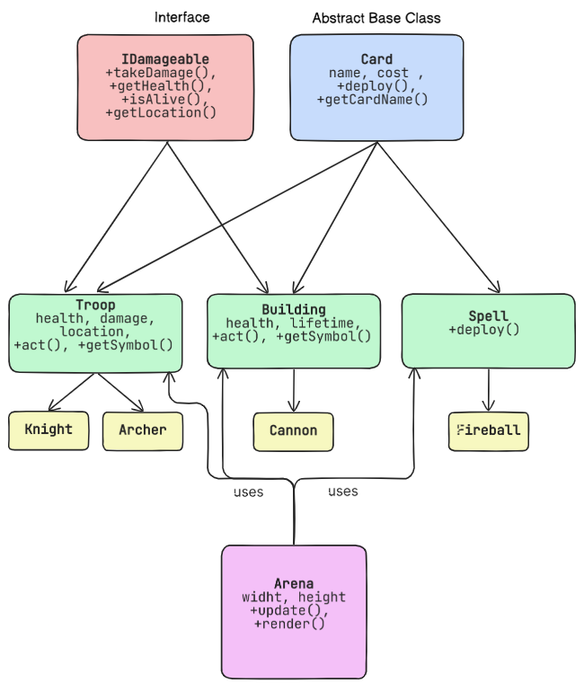

# RoyaleEngine: An Object-Oriented Design and Implementation of Clash Royale

## Overview

RoyaleEngine is a text-based, desktop simulation of core Clash Royale combat mechanics, built from scratch in C++ using Object-Oriented Programming (OOP) principles. This project focuses on modeling unit deployment, movement, targeting, and combat in a simplified 2D arena — without graphics, networking, or elixir systems.

It serves as an educational case study in clean, modular, and extensible software design using the four pillars of OOP: Encapsulation, Inheritance, Polymorphism, and Abstraction.

* No external dependencies — Pure C++17 with standard library only.

---

## Features

* Text-based 2D arena simulation with real-time tick updates
* Polymorphic unit behavior via `act()` method
* Multiple inheritance (Troop and Building inherit from both `Card` and `IDamageable`)
* AI targeting using `getClosestEnemy()` and Manhattan distance
* Event logging for real-time action feedback
* Dynamic memory management with proper cleanup
* Extensible class hierarchy for easy addition of new troops, spells, and buildings

---

## Project Structure

```plaintext
RoyaleEngine/
├── include/
│   ├── Card.h              # Abstract base for deployable units
│   ├── IDamageable.h       # Interface for damageable entities
│   ├── Troop.h             # Mobile units (Knight, Archer)
│   ├── Building.h          # Stationary structures (Cannon)
│   ├── Spell.h             # One-time effects (Fireball)
│   ├── Knight.h, Archer.h, Cannon.h, Fireball.h
│   ├── Arena.h             # Game engine & renderer
│   └── Location.h          # 2D coordinates with distanceTo()
├── src/
│   ├── *.cpp               # Implementations
│   └── main.cpp            # Demo: Knight vs Archer duel
├── CMakeLists.txt
├── README.md               # This file
└── docs/
    └── RoyaleEngine.pdf    # Full project report
```

## UML Diagram



*Figure – UML diagram*

---


